# Legal Agentic RAG Agent Architecture (v3.0)

## Overview

The Legal Agentic RAG Agent is a LangGraph-based state machine that answers legal queries using an intelligent iterative refinement approach:

- **Chain of Thought Memory** - Persistent working memory tracking attempted queries, results, and insights
- **Strategic Planning** - LLM-driven strategy generation integrated into plan_step
- **Hybrid Search** - Vector search (Pinecone) + Graph search (Neo4j) with intelligent routing
- **Intelligent Reranking** - Reranking only in vector space for efficiency
- **Adaptive Search Strategy** - Graph search strategizes based on current strategy (semantic, keyword, principles)
- **Iterative Refinement** - Learns from each iteration to avoid dead-ends and retry patterns

## Main Architecture Flow (v3.0)

```mermaid
graph TD
    A["🧠 plan_step<br/>Strategize Next Query<br/>Update Chain of Thought"] --> B{Route Decision<br/>Vector or Graph?}
    B -->|Vector Search| C["📊 vector_search_node<br/>Semantic Search on Pinecone<br/>Update CoT with Results"]
    B -->|Graph Search| D["🔗 graph_search_node<br/>Strategic Graph Search<br/>Semantic/Keyword/Principles<br/>Update CoT with Results"]
    C --> E["⭐ rerank_results_node<br/>Rerank Top 5 Sources<br/>Vector Space Only"]
    E --> F["✅ evaluate_results_node<br/>LLM Relevance Check"]
    D --> F
    F --> G{Sufficient Info?}
    G -->|No| A
    G -->|Yes| H["🎯 synthesize_answer_node<br/>Generate Final Answer"]
    H --> I["✨ END<br/>Return Answer + Sources<br/>+ Chain of Thought"]

    style A fill:#e1f5ff
    style B fill:#b3e5fc
    style C fill:#fff3e0
    style D fill:#f3e5f5
    style E fill:#fce4ec
    style F fill:#e8f5e9
    style G fill:#c8e6c9
    style H fill:#a5d6a7
    style I fill:#81c784
```



## Key Architectural Changes (v3.0)

### 1. **Chain of Thought Memory** (NEW)
- Persistent working memory throughout agent execution
- Tracks: attempted queries, results summary, promising leads, dead-ends
- Helps avoid retry loops and informs next strategy
- Returned in final response for transparency

### 2. **Integrated Strategic Planning** (REFACTORED)
- `generate_intermediate_question_node` merged into `plan_step`
- Plan step now generates strategy for next search
- Strategy includes: search type, specific approach, what to look for
- Informs route decision and search node behavior

### 3. **Strategy-Aware Route Decision** (ENHANCED)
- Route decision receives strategy context
- Considers graph schema when deciding vector vs graph
- Chooses search method based on query characteristics and strategy

### 4. **Strategic Graph Search** (ENHANCED)
- Receives strategy from plan_step
- Strategizes search approach: semantic, keyword, legal principles
- Adapts search based on current strategy
- Updates chain of thought with findings

### 5. **Vector-Only Reranking** (SIMPLIFIED)
- Reranking only occurs after vector search
- Graph results bypass reranking (already deduplicated)
- Reduces computational overhead
- Cleaner workflow

### 6. **Intelligent Chain of Thought Updates** (NEW)
- Each search node updates CoT with:
  - Query attempted
  - Results summary (count, types, key findings)
  - Promising leads identified
  - Dead-ends detected
  - Suggestions for next iteration

## Detailed Node Descriptions

### 1. **plan_step** (LLM Node) - REFACTORED v3.0
**Purpose**: Strategize next query and decide search approach based on chain of thought

**Inputs**:
- `original_query`: User's initial question
- `chain_of_thought`: Working memory of attempted queries and results
- `retrieved_context`: Previously retrieved sources
- `iteration_count`: Current iteration number

**Process**:
1. **Analyze Chain of Thought**:
   - Review what queries have been attempted
   - Identify promising leads from previous results
   - Identify dead-ends to avoid
   - Determine what information gaps remain

2. **Generate Strategy**:
   - Decide next query to attempt (refined from original or new angle)
   - Choose search approach:
     - For vector: semantic search strategy
     - For graph: semantic search, keyword search, or legal principles search
   - Identify what to look for in results
   - Plan how to filter out dead-ends

3. **Update Chain of Thought**:
   - Add new strategy entry with reasoning
   - Track iteration number and approach

4. **Route Decision**:
   - Decide: "vector" or "graph" search
   - Pass strategy to route decision node

**Outputs**:
- `strategy`: Next search strategy (query, approach, focus areas, filters)
- `current_query`: Query to use for next search
- `chain_of_thought`: Updated with new strategy entry
- `workflow_nodes`: Logged with strategy details

**Key Features**:
- Learns from previous iterations via chain of thought
- Avoids retry loops by tracking attempted queries
- Identifies and filters dead-ends
- Generates focused, strategic queries
- Provides context for route decision and search nodes

---

### 2. **route_action** (Decision Node) - ENHANCED v3.0
**Purpose**: Route to vector or graph search based on strategy and query characteristics

**Inputs**:
- `strategy`: Search strategy from plan_step
- `current_query`: Query to search for
- Graph schema context (passed from plan_step)

**Process**:
1. **Analyze Strategy**:
   - Extract search type preference from strategy
   - Consider search approach recommendations

2. **Evaluate Query Characteristics**:
   - Is query asking for specific cases/precedents? → Vector
   - Is query asking for relationships/connections? → Graph
   - Is query asking for legal principles? → Graph
   - Is query asking for specific statutes? → Graph

3. **Make Routing Decision**:
   - Combine strategy preference with query characteristics
   - Return: "vector" or "graph"

**Outputs**:
- Route decision: "vector" or "graph"

**Key Features**:
- Strategy-aware routing
- Query characteristic analysis
- Graph schema context consideration

---

### 3. **vector_search_node** (Tool Node) - ENHANCED v3.0
**Purpose**: Perform semantic similarity search on Pinecone with strategy awareness

**Inputs**:
- `current_query`: Query to search for
- `strategy`: Search strategy (semantic approach, focus areas)
- `retrieved_context`: Existing sources (for deduplication)
- `chain_of_thought`: Working memory

**Process**:
1. **Execute Semantic Search**:
   - Search Pinecone with semantic embeddings (llama-text-embed-v2)
   - Returns top 10 results by default
   - Deduplicates against existing chunk_ids

2. **Analyze Results**:
   - Summarize key findings
   - Identify promising leads
   - Identify potential dead-ends
   - Extract relevant case numbers, statutes, principles

3. **Update Chain of Thought**:
   - Add query attempted
   - Add results summary (count, types, key cases)
   - Add promising leads identified
   - Add potential dead-ends
   - Add suggestions for next iteration

**Outputs**:
- `retrieved_context`: Appended with new vector sources
- `chain_of_thought`: Updated with search results and insights
- `workflow_nodes`: Logged with search results and dedup stats

**Deduplication Logic**:
- Tracks existing chunk_ids
- Skips sources with duplicate chunk_ids
- Logs duplicate detection

**Chain of Thought Entry Format**:
```
Iteration N - Vector Search:
  Query: "[search query]"
  Results: "[count] sources found"
  Key Cases: [case numbers]
  Promising Leads: [identified opportunities]
  Dead-ends: [queries/cases to avoid]
  Next Steps: [suggestions]
```

---

### 4. **graph_search_node** (Tool Node) - ENHANCED v3.0
**Purpose**: Perform strategic hybrid search on Neo4j based on strategy

**Inputs**:
- `current_query`: Query to search for
- `strategy`: Search strategy (semantic, keyword, or legal principles approach)
- `retrieved_context`: Existing sources (for deduplication)
- `chain_of_thought`: Working memory

**Process**:
1. **Strategize Search Approach**:
   - If strategy says "semantic": Use semantic search on graph embeddings
   - If strategy says "keyword": Use keyword/Cypher queries on relationships
   - If strategy says "principles": Search for specific legal principles and related cases
   - If strategy says "combined": Use all three approaches

2. **Execute Strategic Searches**:
   - Semantic Search: Uses OpenAI embeddings on graph nodes
   - Structured Search: Uses Cypher queries on relationships
   - Principles Search: Queries LegalPrinciple nodes and related cases

3. **Deduplication**:
   - Removes duplicates within each search type
   - Removes duplicates between search types
   - Checks against existing context

4. **Vector Chunk Fetching**:
   - Retrieves associated vector chunks from Pinecone
   - Deduplicates against existing chunk_ids

5. **Analyze Results**:
   - Summarize key findings
   - Identify promising leads
   - Identify potential dead-ends
   - Extract relevant relationships and principles

6. **Update Chain of Thought**:
   - Add query attempted
   - Add results summary (count, types, key nodes)
   - Add promising leads identified
   - Add potential dead-ends
   - Add suggestions for next iteration

**Outputs**:
- `retrieved_context`: Appended with graph sources and vector chunks
- `chain_of_thought`: Updated with search results and insights
- `workflow_nodes`: Logged with detailed metrics

**Deduplication Strategy**:
- Semantic results deduplicated by node identity
- Structured results deduplicated by node identity
- Combined results deduplicated across both types
- Vector chunks deduplicated against existing chunk_ids

**Chain of Thought Entry Format**:
```
Iteration N - Graph Search:
  Query: "[search query]"
  Strategy: "[semantic/keyword/principles/combined]"
  Results: "[count] sources found"
  Key Nodes: [case numbers, statutes, principles]
  Relationships Found: [important connections]
  Promising Leads: [identified opportunities]
  Dead-ends: [queries/nodes to avoid]
  Next Steps: [suggestions]
```

---

### 5. **rerank_results_node** (Tool Node) - SIMPLIFIED v3.0
**Purpose**: Rerank vector sources only and keep top 5 most relevant

**Inputs**:
- `retrieved_context`: All accumulated sources (vector + graph)
- `original_query`: User's original query

**Process**:
1. **Separate Sources**:
   - Extract vector sources
   - Extract graph sources (bypass reranking)

2. **Pre-rerank Deduplication**: Removes duplicate vector sources
   - By chunk_id

3. **Reranking**: Uses Pinecone's bge-reranker-v2-m3 model on vector sources only
   - Reranks vector sources
   - Keeps top 5 vector sources

4. **Combine Results**:
   - Combine top 5 reranked vector sources with all graph sources
   - Total context may exceed 5 sources (vector + graph)

5. **Analysis**: Calculates impact metrics

**Outputs**:
- `retrieved_context`: Updated with reranked vector sources + all graph sources
- `workflow_nodes`: Logged with detailed metrics

**Metrics Tracked**:
- Vector sources removed and removal rate
- Rerank scores (min, max, average)
- Final composition (vector + graph count)

**Key Changes from v2.0**:
- Reranking only on vector sources (not graph)
- Graph sources bypass reranking (already deduplicated)
- Reduces computational overhead
- Cleaner workflow separation

---

### 6. **evaluate_results_node** (Decision Node) - UNCHANGED
**Purpose**: Assess if retrieved sources sufficiently answer the query

**Inputs**:
- `retrieved_context`: Reranked vector + all graph sources
- `original_query`: User's question
- `chain_of_thought`: Working memory for context

**Process**:
- Builds context summary from sources
- Considers chain of thought to avoid retry patterns
- Asks LLM: "Do we have sufficient RELEVANT information?"
- LLM responds: "sufficient" or "insufficient"
- Sets `needs_more_info` flag

**Outputs**:
- `needs_more_info`: Boolean flag
- `workflow_nodes`: Logged with decision and reasoning

**Decision Criteria**:
- Sources directly address query
- Enough specific examples/case law
- Information is comprehensive
- Not repeating previous unsuccessful searches

---

### 7. **synthesize_answer_node** (LLM Node) - ENHANCED v3.0
**Purpose**: Generate final answer using reranked sources and chain of thought

**Inputs**:
- `original_query`: User's question
- `retrieved_context`: Reranked vector + graph sources
- `chain_of_thought`: Working memory of search journey

**Process**:
1. **Format Sources**:
   - Formats sources with relevance scores
   - Organizes by type (vector/graph)

2. **Build Synthesis Prompt**:
   - Includes chain of thought for context
   - Shows search journey and iterations
   - Highlights key findings

3. **Generate Answer**:
   - Asks LLM to answer based on sources
   - Considers search journey context
   - Provides comprehensive response

4. **Track Composition**:
   - Logs source composition used
   - Tracks iterations taken

**Outputs**:
- `response`: Final answer text
- `workflow_nodes`: Logged with synthesis details

**Answer Requirements**:
- Based ONLY on provided context
- Includes source citations
- Concise and accurate
- Acknowledges information gaps
- References search journey when relevant

---

## State Management

### GraphState Structure - v2.0 (Current)

The current agent maintains state through a TypedDict called `GraphState` defined in `src/models/schemas.py`:

```python
class GraphState(TypedDict):
    """Current v2.0 State definition for the LangGraph agent."""
    original_query: str                     # The initial user question
    intermediate_steps: List[tuple]         # History of tool calls and results (for logging/debugging)
    retrieved_context: List[Dict]           # Accumulated context from tools (vector + graph)
    plan: Union[str, None]                  # Agent's plan or next action decision
    response: Union[str, None]              # Final generated answer
    needs_more_info: bool                   # Flag to control potential looping
    iteration_count: int                    # Track number of iterations to prevent infinite loops
    workflow_nodes: List[Dict[str, Any]]    # LangGraph workflow nodes executed (for explainability)
    intermediate_questions: List[str]       # Generated intermediate questions (REMOVED in v3.0)
    current_query: Union[str, None]         # The current query being searched (may be refined)
```

**Total Fields**: 10

---

### GraphState Structure - v3.0 (Proposed)

The proposed v3.0 agent will enhance the state with chain of thought memory and strategy tracking:

```python
class GraphState(TypedDict):
    """Proposed v3.0 State definition for the LangGraph agent."""
    # Core Query Fields
    original_query: str                     # The initial user question (unchanged)
    current_query: Union[str, None]         # The current query being searched (unchanged)

    # NEW: Chain of Thought & Strategy
    chain_of_thought: List[str]             # NEW: Working memory of search journey
    strategy: Union[Dict, None]             # NEW: Current search strategy

    # Search Results
    retrieved_context: List[Dict]           # Accumulated context from tools (unchanged)

    # Agent Decision Making
    plan: Union[str, None]                  # Agent's plan or next action decision (unchanged)
    response: Union[str, None]              # Final generated answer (unchanged)
    needs_more_info: bool                   # Flag to control looping (unchanged)

    # Tracking & Debugging
    iteration_count: int                    # Track number of iterations (unchanged)
    workflow_nodes: List[Dict[str, Any]]    # LangGraph workflow nodes executed (unchanged)
    intermediate_steps: List[tuple]         # History of tool calls and results (unchanged)
```

**Total Fields**: 12 (added 2, removed 1)

---

### Field-by-Field Comparison

| Field | v2.0 | v3.0 | Change | Purpose |
|-------|------|------|--------|---------|
| `original_query` | ✅ | ✅ | Unchanged | The initial user question |
| `current_query` | ✅ | ✅ | Unchanged | Current refined query |
| `intermediate_steps` | ✅ | ✅ | Unchanged | Tool call history |
| `retrieved_context` | ✅ | ✅ | Unchanged | Accumulated search results |
| `plan` | ✅ | ✅ | Unchanged | Agent's plan |
| `response` | ✅ | ✅ | Unchanged | Final answer |
| `needs_more_info` | ✅ | ✅ | Unchanged | Loop control flag |
| `iteration_count` | ✅ | ✅ | Unchanged | Iteration tracking |
| `workflow_nodes` | ✅ | ✅ | Unchanged | Node execution history |
| `intermediate_questions` | ✅ | ❌ | **REMOVED** | Merged into plan_step |
| `chain_of_thought` | ❌ | ✅ | **NEW** | Working memory |
| `strategy` | ❌ | ✅ | **NEW** | Search strategy |

---

### New Field Details

#### 1. `chain_of_thought: List[str]`

**Purpose**: Persistent working memory tracking the agent's search journey

**Format**: List of string entries, one per iteration or major action

**Example Entry**:
```
Iteration 1 - Planning:
  Strategy: Search for cases discussing stock valuation in matrimonial assets
  Query: "stock picks matrimonial assets division"
  Search Type: vector
  Approach: semantic
  Reasoning: Initial exploration of the topic

Iteration 1 - Vector Search:
  Query: "stock picks matrimonial assets division"
  Results: 5 cases found
  Key Cases: Case A (2023_SGHCF_45), Case B (2022_SGHCF_78)
  Promising Leads: Case A directly discusses stock valuation in asset division
  Dead-ends: None identified yet
  Next Steps: Search for related statutes on asset valuation

Iteration 2 - Planning:
  Strategy: Search graph for statutes and legal principles
  Query: "asset valuation matrimonial division statutes"
  Search Type: graph
  Approach: semantic
  Reasoning: Case A cited Statute X; need to understand legal framework

Iteration 2 - Graph Search:
  Query: "asset valuation matrimonial division statutes"
  Strategy: semantic
  Results: 3 statutes, 2 principles found
  Key Nodes: Statute X (directly addresses stock picks), Principle Y (asset division)
  Relationships: Statute X cited in Case A
  Promising Leads: Statute X directly addresses stock picks in asset division
  Dead-ends: Principle Z not relevant to stock picks
  Next Steps: Vector search for cases citing Statute X

Iteration 3 - Planning:
  Decision: Sufficient information gathered
  Action: Synthesize answer
  Reasoning: Have cases, statutes, and principles; ready to generate answer
```

**Usage**:
- `plan_step` reads CoT to understand what's been attempted
- `plan_step` analyzes CoT to identify promising leads and dead-ends
- `vector_search_node` and `graph_search_node` append to CoT with findings
- `synthesize_answer_node` includes CoT in response for transparency
- Returned in final API response for user visibility

**Benefits**:
- Prevents retry loops by tracking attempted queries
- Informs strategy generation with historical context
- Provides transparency into agent's reasoning
- Enables dead-end detection and avoidance

---

#### 2. `strategy: Union[Dict, None]`

**Purpose**: Current search strategy guiding the next search action

**Structure**:
```python
{
    "search_type": "vector" | "graph",           # Which search to perform
    "approach": "semantic" | "keyword" | "principles" | "combined",  # How to search
    "query": str,                                # Refined query string
    "focus_areas": List[str],                    # Key areas to focus on
    "filters": List[str],                        # Queries/cases to avoid
    "reasoning": str                             # Why this strategy was chosen
}
```

**Example Strategy**:
```python
{
    "search_type": "graph",
    "approach": "semantic",
    "query": "asset valuation matrimonial division statutes",
    "focus_areas": ["stock valuation", "asset division", "matrimonial law"],
    "filters": ["inheritance law", "commercial contracts"],
    "reasoning": "Previous vector search found relevant cases. Now search graph for related statutes and principles to understand legal framework. Avoid inheritance and commercial law as they're not relevant to matrimonial assets."
}
```

**Usage**:
- Generated by `plan_step` based on chain of thought analysis
- Passed to `route_action` to decide search type
- Passed to `vector_search_node` or `graph_search_node` to guide search
- Used by `graph_search_node` to choose search approach (semantic/keyword/principles)

**Benefits**:
- Enables intelligent routing decisions
- Guides adaptive graph search strategies
- Provides context for search refinement
- Helps avoid dead-end queries

---

### State Initialization

**v2.0 Initialization**:
```python
initial_state: GraphState = {
    "original_query": query,
    "current_query": query,
    "intermediate_steps": [],
    "retrieved_context": [],
    "plan": None,
    "response": None,
    "needs_more_info": True,
    "iteration_count": 0,
    "workflow_nodes": [],
    "intermediate_questions": [],
}
```

**v3.0 Initialization**:
```python
initial_state: GraphState = {
    "original_query": query,
    "current_query": query,
    "chain_of_thought": [],                 # NEW: Initialize as empty list
    "strategy": None,                       # NEW: Initialize as None
    "intermediate_steps": [],
    "retrieved_context": [],
    "plan": None,
    "response": None,
    "needs_more_info": True,
    "iteration_count": 0,
    "workflow_nodes": [],
}
```

---

### State Evolution Example

**Initial State** (Iteration 0):
```python
{
    "original_query": "Is there precedence for stock picks in matrimonial assets?",
    "current_query": "Is there precedence for stock picks in matrimonial assets?",
    "chain_of_thought": [],
    "strategy": None,
    "retrieved_context": [],
    "iteration_count": 0,
    "needs_more_info": True,
}
```

**After plan_step** (Iteration 1):
```python
{
    "original_query": "Is there precedence for stock picks in matrimonial assets?",
    "current_query": "stock picks matrimonial assets division",
    "chain_of_thought": ["Iteration 1 - Planning: ..."],
    "strategy": {
        "search_type": "vector",
        "approach": "semantic",
        "query": "stock picks matrimonial assets division",
        "focus_areas": ["stock valuation", "asset division"],
        "filters": [],
        "reasoning": "Initial exploration of topic"
    },
    "iteration_count": 1,
}
```

**After vector_search_node** (Iteration 1):
```python
{
    "retrieved_context": [5 vector sources],
    "chain_of_thought": [
        "Iteration 1 - Planning: ...",
        "Iteration 1 - Vector Search: ..."
    ],
}
```

**After rerank_results_node** (Iteration 1):
```python
{
    "retrieved_context": [top 5 vector sources],
}
```

**After evaluate_results_node** (Iteration 1):
```python
{
    "needs_more_info": True,  # Insufficient information
    "iteration_count": 1,
}
```

**After plan_step** (Iteration 2):
```python
{
    "current_query": "asset valuation matrimonial division statutes",
    "chain_of_thought": [
        "Iteration 1 - Planning: ...",
        "Iteration 1 - Vector Search: ...",
        "Iteration 2 - Planning: ..."
    ],
    "strategy": {
        "search_type": "graph",
        "approach": "semantic",
        "query": "asset valuation matrimonial division statutes",
        "focus_areas": ["stock valuation", "asset division", "matrimonial law"],
        "filters": ["inheritance law"],
        "reasoning": "Case A cited Statute X; need legal framework"
    },
    "iteration_count": 2,
}
```

**Final State** (After synthesis):
```python
{
    "response": "Based on the retrieved sources...",
    "chain_of_thought": [all iterations],
    "retrieved_context": [final sources],
    "needs_more_info": False,
    "iteration_count": 2,
}
```

---

### API Response Format

**v2.0 Response**:
```python
{
    "answer": str,
    "sources": List[Source],
    "workflow_nodes": List[WorkflowNode]
}
```

**v3.0 Response** (Enhanced):
```python
{
    "answer": str,
    "sources": List[Source],
    "workflow_nodes": List[WorkflowNode],
    "chain_of_thought": List[str]           # NEW: Returned for transparency
}
```

The chain of thought is now visible to users, providing full transparency into the agent's reasoning process.

---

## Deduplication Strategy (v3.0)

### Vector Source Deduplication
- **Key**: `chunk_id` (unique identifier from Pinecone)
- **When**: Before appending to context in vector_search_node
- **When**: Before reranking in rerank_results_node

### Graph Source Deduplication
- **Key**: Node identity (case_number, statute name+section, etc.)
- **When**: Within semantic results
- **When**: Within structured results
- **When**: Between semantic and structured results
- **When**: Before appending to context in graph_search_node

### Cross-Source Deduplication
- **When**: Before reranking (removes duplicates across all sources)
- **Strategy**: Maintains separate tracking for vector and graph sources

---

## Iteration Flow (v3.0)

The agent iterates intelligently based on chain of thought:

1. **Iteration 1**:
   - plan_step (generate initial strategy)
   - route_action (decide vector or graph)
   - search (vector or graph)
   - rerank (vector only)
   - evaluate (check sufficiency)

2. **If insufficient**:
   - plan_step analyzes chain of thought
   - Generates new strategy avoiding dead-ends
   - Back to route_action

3. **If sufficient**:
   - synthesize_answer (generate final answer)
   - END (return answer + sources + chain of thought)

**Max Iterations**: 10 (configurable via recursion_limit)

**Key Improvements**:
- Chain of thought prevents retry loops
- Strategy generation learns from previous iterations
- Dead-end detection avoids wasted searches
- Promising leads guide next searches

---

## Data Flow Summary (v3.0)

```
User Query
    ↓
plan_step (analyze CoT, generate strategy)
    ↓
route_action (decide: vector or graph based on strategy)
    ↓
vector_search_node OR graph_search_node
    ↓ (with deduplication + CoT update)
retrieved_context accumulates
    ↓
rerank_results_node (vector only, dedup + keep top 5 vector)
    ↓
evaluate_results_node (check sufficiency, consider CoT)
    ↓
[If insufficient] → back to plan_step (with updated CoT)
[If sufficient] → synthesize_answer_node
    ↓
Final Answer + Sources + Chain of Thought + Workflow History
```

---

## Key Features (v3.0)

✅ **Chain of Thought Memory**: Persistent working memory tracking search journey
✅ **Intelligent Strategy Generation**: LLM-driven strategy in plan_step
✅ **Hybrid Search**: Combines vector and graph search for comprehensive coverage
✅ **Strategic Routing**: Route decision considers strategy and query characteristics
✅ **Adaptive Graph Search**: Strategizes search approach (semantic/keyword/principles)
✅ **Vector-Only Reranking**: Simplified workflow with reranking only on vector sources
✅ **Comprehensive Deduplication**: Prevents duplicate sources across iterations
✅ **Dead-End Detection**: Identifies and avoids unsuccessful search patterns
✅ **Promising Lead Tracking**: Identifies and prioritizes promising directions
✅ **Full Transparency**: Tracks all workflow nodes + chain of thought
✅ **Context-Aware Planning**: Uses graph schema and current info for decisions
✅ **Source Attribution**: Maintains source metadata for citations

---

## Workflow Nodes (v3.0)

The agent now has **6 main nodes** (down from 7):

1. **plan_step** - Strategic planning with chain of thought
2. **route_action** - Strategy-aware routing decision
3. **vector_search_node** - Semantic search with CoT updates
4. **graph_search_node** - Strategic graph search with CoT updates
5. **rerank_results_node** - Vector-only reranking
6. **evaluate_results_node** - Relevance evaluation
7. **synthesize_answer_node** - Final answer generation

**Removed**: generate_intermediate_question_node (merged into plan_step)

---

## Implementation Notes

### Chain of Thought Management
- Initialize as empty list in initial state
- Each search node appends a detailed entry
- Plan step reads and analyzes for strategy generation
- Returned in final response for transparency

### Strategy Structure
```python
{
    "search_type": "vector" or "graph",  # Recommended search type
    "approach": "semantic" or "keyword" or "principles" or "combined",  # For graph search
    "query": "refined query string",     # Query to use
    "focus_areas": ["area1", "area2"],   # What to look for
    "filters": ["filter1", "filter2"],   # What to avoid/filter
    "reasoning": "why this strategy"     # Explanation
}
```

### Dead-End Detection
- Track queries that returned no relevant results
- Track queries that returned only previously seen results
- Track queries that contradicted previous findings
- Suggest alternative approaches in strategy

### Promising Lead Tracking
- Identify cases/statutes that directly address query
- Identify relationships that suggest new search directions
- Identify principles that apply to the query
- Suggest follow-up searches based on leads

