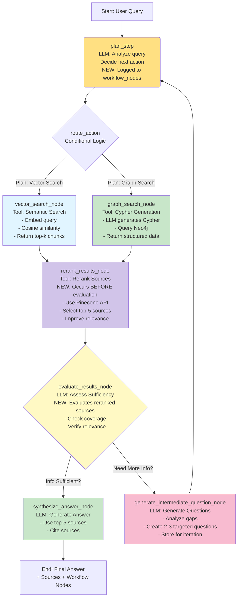

# Singapore Supreme Family Court Agentic Search

## 1. Background / High-level View
A hybrid vector-based + Knowledge Graph based system, built with an LLM agent to answer questions related to Singapore Supreme Family Court cases.

## 2. Top Level Tech Stack

* **Python Version:** `3.10.12`

### Core Python Libraries
* **Web Framework:** `fastapi`
* **Web Server (Dev):** `uvicorn`
* **Web Server (Prod):** `gunicorn`
* **Orchestration:** `langchain 1.0.2`, `langchain-openai 1.0.1`, `langchain-core 1.0.1`, `langchain-neo4j 0.5.0`, ``
* **LLM API:** `openai` (for `gpt-4o-mini`)
* **Vector DB Client:** `pinecone-client`

### External Services
* **LLM Agent:** OpenAI `gpt-4o-mini`
* **Embedding Model:** `llama-text-embed-v2` (Hosted by Pinecone)
* **Vector DB:** Pinecone DB
* **Graph DB:** Neo4j Aura

## 3. Ingestion Pipeline

### Data Source
#### eLitigation
- details under the URL link template of `https://www.elitigation.sg/gd/s/<YYYY>_SGHCF_<case_number>`

#### Webscraping strategy
- Jina AI is used to extract information from the eLitigation website.

### Vector Ingestion Pipeline

_It is noted that the judgements are already "split" into clean sections on eLitigation_
1. Each section as specified on eLitigation is treated as a "document"
2. documents are stored with this structure

```json
{
    "id": "case_extract_<YYYY>_<case_number>_<section>",
    "case_extract_name": "case_extract_<YYYY>_<case_number>",
    "chunk_text": "<content>"
}
```

3. embeddings are generated for each document by Pinecone's in built `llama-text-embed-v2`
4. documents are upserted into Pinecone DB

### Graph Ingestion Pipeline

This pipeline runs after vector ingestion is complete. It uses the `gpt-4o-mini` LLM to perform entity and relationship extraction from the text to build a structured graph of legal reasoning.

Ingestion happens at the case_extract level.

**Step 1: Fetch Case Extract from Pinecone**

1. Fetch Chunks
2. Sort Chunks
3. Concatenate Chunks

**Step 2: 1st Pass Extraction**

_Extracting the top level information_

1. `(:Case)` Node information
2. Relevant `(:Person)` nodes
3. `(LegalPrinciple)` nodes

**Step 3: 2nd Pass Extraction**

_Extracting the arguments and reasoning_

1. `(:Argument)` nodes
2. Relationships between `(:Argument)` nodes and other nodes

#### Graph Schema

##### Nodes

These are the main nodes to be extracted

* `(:Case)`
    * **`case_number`**: `string` (Unique ID, e.g., "2024_SGHCF_1")
    * **`name`**: `string` (e.g., "ABC v XYZ")
    * **`date`**: `date` (The date of the judgment)
    * **`year`**: `integer` (e.g., 2024)
    * **`summary`**: `string` (The high-level background of the case)
    * **`summary_embedding`**: `list[float]` (1024-dimensional vector embedding of case summary for semantic search)
    * **`outcome`**: `string` (The final conclusion, e.g., "Appeal allowed")
    * **`outcome_embedding`**: `list[float]` (1024-dimensional vector embedding of case outcome for semantic search)

* `(:Person)`
    * **`name`**: `string` (The unique identifier. This is a **canonical name** for Judges/Lawyers or a **composite ID** for parties. See 3.4.3.)
    * **`role`**: `PersonRole | string` (Enum: "Judge", "Appellant", "Respondent", "Lawyer for Appellant", "Lawyer for Respondent", "Witness", "Mediator", "Others")
    * **`role_others`**: `string` (Optional: Additional role details if role is "Others")

* `(:Statute)`
    * **`name`**: `string` (The name of the act, e.g., "Women's Charter (Cap 353)")
    * **`section`**: `string` (The specific section, e.g., "Section 112")
    * **`summary`**: `string` (Summary of the statute)
    * **`summary_embedding`**: `list[float]` (1024-dimensional vector embedding of statute summary for semantic search)

* `(:LegalPrinciple)`
    * **`name`**: `LegalPrincipleType | string` (Enum: "Division of Matrimonial Assets", "Custody, Care and Control", "Maintenance and Support", "Guardianship", "Adoption", "Ancillary Matters", "Family Violence", "Matrimonial Property", "Child Protection", "Succession", "Others")
    * **`name_others`**: `string` (Optional: Additional principle details if name is "Others")

* `(:Argument)`
    * **`summary`**: `string` (A 1-2 sentence summary of the **party's claim**)
    * **`summary_embedding`**: `list[float]` (1024-dimensional vector embedding of argument summary for semantic search)
    * **`judge_reasoning`**: `string` (A 1-2 sentence summary of the **judge's evaluation** of that claim)
    * **`judge_reasoning_embedding`**: `list[float]` (1024-dimensional vector embedding of judge's reasoning for semantic search)
    * **`outcome`**: `ArgumentOutcome | string` (Enum: "Accepted", "Rejected", "Partially Accepted", "Dismissed", "Allowed", "Dismissed with Costs", "Others")
    * **`outcome_others`**: `string` (Optional: Additional outcome details if outcome is "Others")
    * **`section`**: `string` (The document section where this argument is discussed, e.g., "Section 7")
    * **`vector_chunk_ids`**: `list[string]` (A list of one or more chunk IDs from Pinecone that contain the full text for this argument, e.g., `["case_extract_2024_24_chunk_4", "case_extract_2024_24_chunk_5", "case_extract_2024_24_chunk_8", "case_extract_2024_24_chunk_9"]`)

##### Relationships

All relationships use the `RelationshipType` enum for type safety:

* `(:Person)-[:PRESIDED_OVER]->(:Case)` - A judge presided over a case
* `(:Person)-[r:IS_PARTY_IN]->(:Case)` - A person is a party in a case
    * **`r.objective`**: `string` (The goal of the appeal, e.g., "To increase share of matrimonial assets")
* `(:Person)-[:REPRESENTED]->(:Person)` - A lawyer represented a party
* `(:Case)-[:CITES]->(:Case)` - A case cites another case as precedent
* `(:Case)-[:CITES]->(:Statute)` - A case cites a statute
* `(:Case)-[:CONTAINS]->(:Argument)` - A case contains an argument
* `(:Case)-[:IS_RELATED_TO]->(:LegalPrinciple)` - A case is related to a legal principle
* `(:Person)-[:MADE]->(:Argument)` - A person made an argument
* `(:Argument)-[:IS_ABOUT]->(:LegalPrinciple)` - An argument is about a legal principle
* `(:Argument)-[:REFERENCES]->(:Case)` - An argument references a case
* `(:Argument)-[:REFERENCES]->(:Statute)` - An argument references a statute

##### Ingestion & Entity Resolution Strategy

**`Argument` Nodes (Event Logic)**

* `(:Argument)` nodes represent **events** of reasoning, not unique entities.
* The agent **must `CREATE`** a new `(:Argument)` node for *each* distinct argument and reasoning block it finds in the text. This is intentional and necessary to capture the document's flow.

**Entity Nodes (Entity Logic)**

* All other nodes (`:Case`, `:Person`, `:Statute`, `:LegalPrinciple`) are **entities**.

`MERGE` strategy:

* **`(:Case)`:** `MERGE` on the `case_number` property.
    * *Example:* `MERGE (c:Case {case_number: "2024_SGHCF_1"})`
    * Each case "ingestion" will only ever contain a single `:Case` node.

* **`(:LegalPrinciple)`:** `MERGE` on the `name` property.
    * *Example:* `MERGE (lp:LegalPrinciple {name: "Division of Matrimonial Assets"})`
    * If the agent extracts the same `:LegalPrinciple` node multiple times, it should `MERGE` on the first occurrence.
        * in particular, the `name` property should be a **canonical name** and should be consistent across all case extractions

* **`(:Statute)`:** `MERGE` on *both* the `name` and `section` properties.
    * *Example:* `MERGE (s:Statute {name: "Women's Charter (Cap 353)", section: "Section 112"})`

* **`(:Person)` - Special Handling:**
    * **For Global Roles (e.g., "Judge", "Lawyer"):**
        1.  The agent will first **normalize** the extracted name (e.g., "Justice Tan Lee Meng" -> "Tan Lee Meng").
        2.  It will `MERGE` on this **canonical name**.
        3.  *Example:* `MERGE (p:Person {name: "Tan Lee Meng", role: "Judge"})`
    * **For Case-Specific Roles (e.g., "Appellant", "Respondent"):**
        1.  The agent will create a **composite unique ID** from the role, initials, and the case number.
        2.  It will `MERGE` on this **composite ID**.
        3.  *Example:* `MERGE (p:Person {initials: "XDJ", role: "Appellant", case_number: "2025_SGHCF_11"})`
        4.  The `name` property will be set to the **composite ID**.
        5.  *Example:* `SET p.name = "XDJ-Appellant-2025_SGHCF_11"`
        6.  Within the same case, when processing various different chunks, the agent should be careful in de-duplicating the references made to various parties. 

## 4. Agentic Query Pipeline (`main.py` using LangGraph)

This phase defines the live API service that users interact with. It's built using FastAPI and runs on a Render Web Service, with LangGraph handling the core agentic logic.

### API Specification

* **Framework:** `fastapi~=0.111.0`
* **Endpoint:** `POST /query`
* **Request Body:** Uses Pydantic (`pydantic>=2.0.0,<3.0.0`)
    ```python
    from pydantic import BaseModel

    class QueryRequest(BaseModel):
        query: str
    ```
* **Response Body:** Uses Pydantic
    ```python
    from pydantic import BaseModel, Field
    from typing import List, Union, Dict, Any

    class Source(BaseModel):
        type: str = Field(..., description="Source type: 'vector' or 'graph'")
        chunk_id: Union[str, None] = Field(None, description="ID of the vector chunk from Pinecone")
        data: Union[str, Dict[str, Any]] = Field(..., description="Retrieved text chunk (vector) or structured data (graph)")
        metadata: Dict[str, Any] = Field({}, description="Metadata associated with the source (e.g., case_number, section)")

    class QueryResponse(BaseModel):
        answer: str = Field(..., description="The final synthesized answer from the LLM")
        sources: List[Source] = Field(..., description="List of sources used to generate the answer")
    ```

---

### Agentic Orchestration (LangGraph State Machine) 🧠🔗

The core logic uses a LangGraph state machine (`langgraph`) for multi-step reasoning.

* **LLM:** `gpt-4o-mini` (via `ChatOpenAI` from `langchain-openai~=1.0.1`)
* **Framework:** LangGraph (part of `langchain~=1.0.2`), `langchain-core~=1.0.1`

#### Agent Graph State

Defines the data passed between graph nodes.

```python
from typing import List, TypedDict, Union, Dict, Any
from langchain_core.messages import BaseMessage

# Using TypedDict for state definition
class GraphState(TypedDict):
    original_query: str                  # The initial user question
    intermediate_steps: List[tuple]     # History of tool calls and results (for logging/debugging)
    retrieved_context: List[Dict]      # Accumulated context from tools (vector + graph)
    plan: Union[str, None]               # Agent's plan or next action decision
    response: Union[str, None]           # Final generated answer
    needs_more_info: bool                # Flag to control potential looping
    intermediate_questions: List[str]    # Generated follow-up questions (NEW)
    current_query: Union[str, None]      # Current query being searched (original or intermediate) (NEW)
    iteration_count: int                 # Track iteration number (NEW)
    workflow_nodes: List[Dict]           # Track execution history of all nodes (NEW)
```

#### Agent Graph Nodes

Functions representing steps in the reasoning process:

1. `plan_step` **(LLM Node)** - NEW: Now Logged:

    * Input: original_query, intermediate_steps, intermediate_questions from state.
    * Function: Uses gpt-4o-mini to analyze the query and history, deciding the next action (e.g., call vector_search, graph_search, or synthesize_answer).
    * NEW: Creates workflow_node entry for complete visibility in API response
    * Updates State: plan (string describing the next action), workflow_nodes (adds plan_step entry).

2. `route_action` **(Conditional Logic Node)**:

    * Input: plan from state.
    * Function: Python logic to determine the next node based on the plan.
    * Updates State: None (Directs flow).

3. `vector_search_node` **(Tool Node)**:

    * Input: plan (containing query/IDs), original_query from state.
    * Function: Executes the vector_search tool (see 4.3).
    * Updates State: Appends results to retrieved_context, adds step to intermediate_steps.

4. `graph_search_node` **(Tool Node)**:

    * Input: plan (containing query), original_query from state.
    * Function: Executes the graph_search tool (see 4.3).
    * Updates State: Appends results to retrieved_context, adds step to intermediate_steps. May update plan if vector_chunk_ids are found.

5. `evaluate_results_node` **(LLM Node)** - UPDATED: Now Evaluates Reranked Sources:

    * Input: original_query, retrieved_context (already reranked top-5 sources) from state.
    * Function: Uses gpt-4o-mini to assess if the current context is sufficient to answer the query.
    * NEW: Now evaluates already-reranked top-5 sources (not all sources)
    * Process:
        1. Checks if both vector and graph search types were attempted
        2. Evaluates relevance of reranked sources to the query
        3. Decides whether to synthesize or generate intermediate questions
    * Updates State: needs_more_info (boolean), workflow_nodes (adds evaluation details).

6. `generate_intermediate_question_node` **(LLM Node)** - NEW:

    * Input: original_query, retrieved_context, iteration_count from state.
    * Function: When evaluation indicates insufficient information, uses gpt-4o-mini to generate 2-3 targeted follow-up questions that address information gaps.
    * Process:
        1. Analyzes the original query and current context
        2. Identifies missing information or unexplored angles
        3. Generates specific, focused questions for more targeted searches
        4. Stores questions sequentially for iterative use
    * Updates State: intermediate_questions (list of generated questions), workflow_nodes (adds execution details).

7. `rerank_results_node` **(Tool Node)** - NEW POSITION: Before Evaluation:

    * Input: retrieved_context from state (all sources from vector and graph search).
    * Function: Uses Pinecone's reranking API to intelligently rank all retrieved sources and select the top-5 most relevant.
    * NEW: Now executes BEFORE evaluation (not after)
    * Process:
        1. Combines all vector and graph search results
        2. Reranks using Pinecone's bge-reranker-v2-m3 model
        3. Selects top-5 most relevant sources
        4. Logs detailed reranking impact metrics
    * Updates State: retrieved_context (reranked and filtered to top-5), workflow_nodes (adds reranking details).

8. `synthesize_answer_node` **(LLM Node)**:

    * Input: original_query, retrieved_context from state.
    * Function: Uses gpt-4o-mini with the synthesis prompt (see 4.4) to generate the final response using the top-5 reranked sources.
    * Updates State: response.

#### Agent Graph Edges/Flow (Updated: Reranking Before Evaluation)

Defines the sequence and conditional logic:

1.  **Entry Point:** Graph starts at `plan_step`.
    * NEW: `plan_step` now logs itself to `workflow_nodes` for complete visibility
2.  **Planning -> Routing:** `plan_step` output goes to `route_action`.
    * If intermediate questions are available, uses the first question as the current query
    * Otherwise uses the original query
3.  **Routing -> Tools:** `route_action` uses **conditional edges**:
    * If plan involves vector search -> `vector_search_node`.
    * If plan involves graph search -> `graph_search_node`.
4.  **Tools -> Reranking:** Outputs of `vector_search_node` and `graph_search_node` go to `rerank_results_node` (NEW ORDER).
    * NEW: Reranking now occurs BEFORE evaluation
    * Selects top-5 most relevant sources from all retrieved results
5.  **Reranking -> Evaluation:** `rerank_results_node` passes reranked context to `evaluate_results_node`.
    * Evaluation now works with already-filtered top-5 sources
6.  **Evaluation -> Question Generation/Synthesis:** `evaluate_results_node` uses **conditional edges**:
    * If `needs_more_info == True` -> Go to `generate_intermediate_question_node`.
    * If `needs_more_info == False` -> Go to `synthesize_answer_node` (directly, no reranking again).
7.  **Question Generation -> Planning:** `generate_intermediate_question_node` generates 2-3 targeted questions and returns to `plan_step` for iterative search.
8.  **Finish:** `synthesize_answer_node` is the graph's end node.

**Workflow Summary:**
```
plan_step → route_action → vector/graph_search → rerank → evaluate → synthesize/question_generation
```

**LangGraph Flow Diagram (with Intermediate Questions & Reranking Before Evaluation):**



**Detailed Tool Interaction Diagram:**


### Tools

These functions are executed by the graph nodes.

#### `vector_search` Tool

**Purpose:** Semantic search across case documents and node descriptions using vector embeddings.

* **Function:** Queries the Pinecone index. Supports semantic search and fetching by ID.
* **Input:**
  * `query: str` - Natural language query to search for semantically similar content
  * `fetch_ids: list[str]` (Optional) - Specific chunk IDs to fetch from Pinecone
  * `top_k: int` (Optional, default=5) - Number of results to return
* **Process:**
  1. Embeds the query using Pinecone's `llama-text-embed-v2` model (1024 dimensions)
  2. Performs cosine similarity search against all vector chunks
  3. Returns top-k most similar chunks with similarity scores
  4. Alternatively, fetches specific chunks by ID if `fetch_ids` provided
* **Output:** A list of `Source` objects with:
  * `type: 'vector'`
  * `chunk_id: str` - Pinecone chunk ID
  * `data: str` - Text content of the chunk
  * `metadata: dict` - Case number, section, similarity score
* **Search Scope:**
  * Case summaries and outcomes
  * Statute summaries
  * Argument summaries and judge reasoning
  * Full case text sections
* **Libraries:** `pinecone-client~=4.1.0`

#### `graph_search` Tool

**Purpose:** Structured search across the Neo4j knowledge graph using natural language queries converted to Cypher.

* **Function:** Converts natural language to Cypher, queries Neo4j, and returns structured results including `vector_chunk_ids`.
* **Implementation:** Uses LangChain's Text-to-Cypher capabilities via `langchain-neo4j~=0.5.0`.
* **Initialization:** Requires the Neo4j graph schema (defined in Phase 1).
* **Input:** `query: str` - Natural language query about legal relationships and entities
* **Process:**
  1. LLM (`gpt-4o-mini`) analyzes the query to understand intent
  2. Generates appropriate Cypher query based on graph schema
  3. Executes Cypher against Neo4j Aura database
  4. Formats results with entity information and relationships
  5. Retrieves associated `vector_chunk_ids` for full text context
* **Output:** A list of `Source` objects with:
  * `type: 'graph'`
  * `data: dict` - Structured entity/relationship data (Cases, Arguments, Persons, etc.)
  * `metadata: dict` - Entity types, relationship types, case numbers
  * Includes `vector_chunk_ids` for fetching full text from Pinecone
* **Search Capabilities:**
  * Find cases by legal principle
  * Find arguments and their outcomes
  * Find related cases and precedents
  * Find parties and their roles
  * Traverse relationships (e.g., "Who represented whom?")
  * Semantic search on node embeddings (summary_embedding, outcome_embedding, etc.)
* **Hybrid Semantic-Graph Search:**
  * Can search by semantic similarity on embedded fields (Case.summary_embedding, Argument.judge_reasoning_embedding, etc.)
  * Combines graph structure with semantic understanding
  * Returns both structured relationships and semantically similar content
* **Libraries:** `langchain-neo4j~=0.5.0`, `neo4j~=5.20.0`

---

### Synthesizer (within `synthesize_answer_node`) 📝

The final answer generation logic is encapsulated within the `synthesize_answer_node`.

* **LLM:** `gpt-4o-mini`
* **Process:** Constructs a prompt with all `retrieved_context`, instructs the LLM to answer the `original_query` based **only** on the context, and cite sources.
* **Prompt Example:**
    ```
    Based **only** on the following information:

    **Vector Context:**
    * Chunk ID `[chunk_id_1]`: "[Text content...]"

    **Graph Context:**
    * Argument Summary: "[Argument summary...]", Judge Reasoning: "[Judge reasoning...]", Chunk IDs: `[chunk_id_1]`

    Answer the user's original query: `[User Query]`

    Provide a concise answer. Cite sources using their Chunk IDs like `(Source: [chunk_id])`.
    ```

---

## Local Development Setup Guide

Use venv + specific python version 3.11.0

Set python version using pyenv

Use venv to create a virtual environment

```bash
python -m venv venv
source venv/bin/activate
pip install -r requirements.txt
```

## Render Deployment Configuration (`render.yaml`)

* **Service Type:** Web Service
* **Runtime:** Python 3.10
* **Build Command:** `pip install -r requirements.txt`
* **Start Command:** `gunicorn -w 4 -k uvicorn.workers.UvicornWorker main:app --timeout 120`
* **Environment Variables:**
    * `OPENAI_API_KEY`
    * `PINECONE_API_KEY`
    * `NEO4J_URI`
    * `NEO4J_USERNAME`
    * `NEO4J_PASSWORD`
* **`requirements.txt`:**
    ```plaintext
    fastapi~=0.111.0
    uvicorn~=0.29.0
    gunicorn~=22.0.0
    langchain~=1.0.2
    langchain-openai~=1.0.1
    langchain-core~=1.0.1
    langchain-neo4j~=0.5.0
    langgraph # Ensure langgraph is installed
    openai~=1.30.0
    pinecone-client~=4.1.0
    neo4j~=5.20.0
    pydantic>=2.0.0,<3.0.0
    python-dotenv~=1.0.1
    requests~=2.31.0
    tiktoken~=0.7.0
    ```

## 5. Testing

Unit tests should be in place for every code section - Unit tests are in `test` folder, with all test cases related to a functions in a separate file.